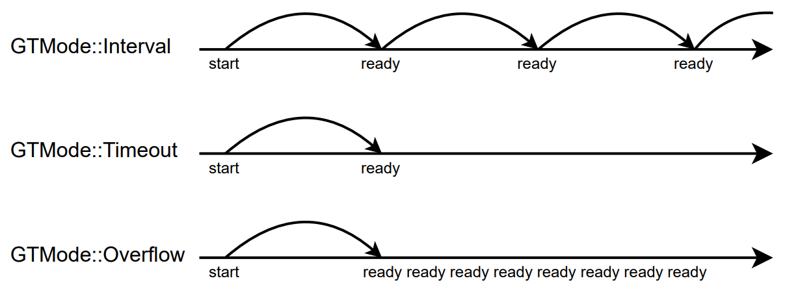
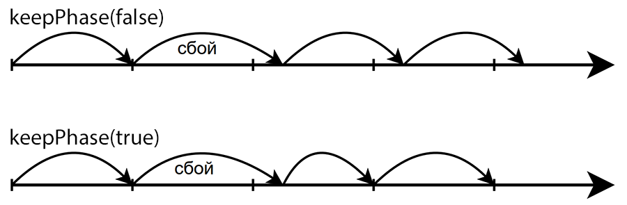

This is an automatic translation and may be incorrect in some places. See the source README and examples for authoritative information.

[](https://github.com/GyverLibs/GTimer/releases/latest/download/GTimer.zip)
[](https://registry.platformio.org/libraries/gyverlibs/GTimer)
[](https://alexgyver.ru/)
[](https://alexgyver.ru/support_alex/)
[](https://github-com.translate.goog/GyverLibs/GTimer?_x_tr_sl=ru&_x_tr_tl=en)  

[](https://t.me/GyverLibs)

# GTimer
Easy and universal program timer
- Works with`millis`, `micros`and any other functions of the Uptime type`unsigned long uptime()`
- 3 modes of operation: interval timer, timeout, overflow
- 3 memory options: 8, 16 and 32 bit periods
- Possibility of suspension and continuation of the account
- Two variants of the interval phase
- Easy implementation - two variables under timer + 1 byte settings
- Collback and Virtual Inheritance Function

### Compatibility
All platforms.

## Contents
- [Use of use](#usage)
- [Versions](#versions)
- [Installation](#install)
- [Bugs and feedback](#feedback)

<a id="usage"></a>

## Use of use
> [!NOTE]
> The timer correctly passes through the "overflow" of the uptime function (millis, micros).

### Mode of work
- `GTMode::Interval`- the timer restarts after operation
- `GTMode::Timeout`- the timer stops after operation
- `GTMode::Overflow`- the timer is triggered after operation



### Phase mode
In mode.`keepPhase`activation of the interval multiple of the period even with delays in the program:



### Initialization
The library contains 6 timer options:
- `GTimer`32 bit periods (up to 4,294,967,295)
- `GTimer16`16 bit periods (up to 65,535)
- `GTimer8`- 8 bit periods (up to 255)
- `GTimerCb`, `GTimerCb16`, `GTimerCb8`- Same thing, but with a callback.

```cpp
GTimerX<uptime>(uint32_t time, bool start = false, GTMode mode = GTMode::Interval, bool keepPhase = false);
```

- `uptime`- uptime function (`millis`, `micros`kind of function`unsigned long uptime(void)`)
- `time`- time in timer units
- `start`launch immediately
- `mode`mode of operation
- `keepPhase`- interval phase mode

### Description of classes
#### GTimerX

```cpp
// Keep the phase in Interval mode (silent. false)
void keepPhase(bool keep);

// phase out
bool getPhase();

// time-set
void setTime(uint32_t time);

// set the time (for ms)
void setTime(uint32_t ms, uint32_t sec, uint16_t min = 0, uint16_t hour = 0, uint16_t day = 0);

// timed
T getTime();

// set to GTMode::Interval, GTMode::Timeout, GTMode::Overflow
void setMode(GTMode mode);

// Get GTMode::Interval, GTMode::Timeout, GTMode::Overflow
GTMode getMode();

// start with time indication (for ms)
void start(uint32_t ms, uint32_t sec, uint16_t min = 0, uint16_t hour = 0, uint16_t day = 0);

// launch
void start(uint32_t time, GTMode mode);

// timing
void start(uint32_t time);

// launch/reset
void start();

// suspend
void pause();

// continue
void resume();

// stop
void stop();

// trigger
void force();

// timer
bool running();

// Time has passed in timer units
T getCurrent();

// Time left in timer units
T getLeft();

// 8 bits left (0..255)
uint8_t getLeft8();

// 16 bits left (0.65,535)
uint16_t getLeft16();

// ticker, call the loop. It will return true when triggered.
bool tick();

// tick
operator bool();
```

#### GTimerCbX

```cpp
// launch
GTimerCbX(uint32_t time, TimerCallback cb, GTMode mode = GTMode::Interval, bool keepPhase = false);

// timer
void attach(TimerCallback cb);

// turn off timer handler
void detach();

// timeout
void startTimeout(uint32_t time, TimerCallback cb);

// interval
void startInterval(uint32_t time, TimerCallback cb);

// overflow
void startOverflow(uint32_t time, TimerCallback cb);

// triggered
virtual void onReady();
```

- `TimerCallback`function`void f()`
- `void* thisGTimer`- pointer to the current timer inside the handler

#### uTimerX
The most compact class of timer:

- `uTimer8`8 bits.
- `uTimer16`- 16 bits.
- `uTimer`- 32 bits.

```cpp
uTimer(bool start = false);

// launch/reset
void start();

// stop
void stop();

// time-out
bool timeout(T tout);

// interval
bool interval(T prd);

// phase
bool phase(T prd);

// flooding
bool overflow(T prd);

// timer
bool running();

// Time has passed since the start.
T elapsed();
```

### Macros
```cpp
// EVERY
EVERY_T(prd, uptime, T);

EVERY_S(s);

EVERY_MS(ms);
EVERY16_MS(ms);
EVERY8_MS(ms);

EVERY_US(us);
EVERY16_US(us);
EVERY8_US(us);

// PHASE
PHASE_T(prd, uptime, T);

PHASE_S(s);

PHASE_MS(ms);
PHASE16_MS(ms);
PHASE8_MS(ms);

PHASE_US(us);
PHASE16_US(us);
PHASE8_US(us);
```

- Type
  - `EVERY`- reset timer = uptime
  - `PHASE` - timer += prd
- Units
  - `S`- seconds.
  - `MS`- milliseconds.
  - `US`- microseconds.
- Delicacy
  - No number - 32-bit counter (up to 4,294,967,295 units)
  - `16`16-bit counter (up to 65,535 units)
  - `8`8-bit counter (up to 255 units)

You can override standard uptime functions in macros`_MS`and`_US`:

```cpp
// before connecting the library
#define GT_MACRO_MILLIS millis
#define GT_MACRO_MICROS micros
```

## Examples
### Normal.
```cpp
#include <Arduino.h>
#include <GTimer.h>

GTimer<millis> tmr1;

void setup() {
    Serial.begin(115200);

    tmr1.setMode(GTMode::Timeout);
    tmr1.setTime(2000);
    tmr1.start();
}

void loop() {
    if (tmr1) Serial.println("timeout");

    static GTimer<millis> tmr2(500, true);
    if (tmr2) Serial.println("interval");
}
```

### Processor
```cpp
#include <Arduino.h>
#include <GTimer.h>

GTimerCb<millis> tmr1, tmr2;

void onTimer() {
    Serial.println("ready 2");
}

void setup() {
    Serial.begin(115200);

    // lambda
    tmr1.startInterval(500, []() {
        Serial.println("ready 1");

        // timer
        // static_cast<GTimerCb<millis>*>(thisGTimer)->stop();
    });

    // external
    tmr2.startInterval(1000, onTimer);
}

void loop() {
    tmr1.tick();
    tmr2.tick();

    static GTimerCb<millis> tmr3(500, []() {
        Serial.println("ready 3");
    });
    tmr3.tick();
}
```

### Virtual
```cpp
#include <Arduino.h>
#include <GTimer.h>

class TestTimer : public GTimerCb<millis> {
   public:
    using GTimerCb<millis>::GTimerCb;

    void onReady() {
        Serial.println("ready");
    }
};

TestTimer tmr(500, true);

void setup() {
    Serial.begin(115200);
}

void loop() {
    tmr.tick();
}
```

### macro
```cpp
#include <Arduino.h>
#include <GTimer.h>

void setup() {
    Serial.begin(115200);
}

void loop() {
//   EVERY_T(500, millis) Serial.println("500 ms!");
  
//   EVERY_T(100000, micros) {
//     Serial.println("100000 us!");
//   }

  EVERY_MS(500) Serial.println("500 ms!");

  EVERY_US(100000) {
    Serial.println("100000 us!");
  }

  EVERY_S(5) {
    Serial.println("5 s!");
  }
}
```

### uTimer
```cpp
#include <GTimer.h>

void setup() {
    Serial.begin(115200);
    Serial.println("start");
}

uTimer16<millis> tmr(true);

void loop() {
    if (tmr.timeout(500)) {
        Serial.println("tout");
    }
}
```

<a id="versions"></a>

## Versions
- v1.0
- v1.0.1 - EVERY macro added   T

<a id="install"></a>
## Installation
- The library can be found under the name **GTimer** and installed through the library manager in:
    - Arduino IDE
    - Arduino IDE v2
    - PlatformIO
- [Download the library](https://github.com/GyverLibs/GTimer/archive/refs/heads/main.zip).zip archive for manual installation:
    - Unpack and put in *C:\Program Files (x86)\Arduino\libraries* (Windows x64)
    - Unpack and put in *C:\Program Files\Arduino\libraries* (Windows x32)
    - Unpack and put in *Documents/Arduino/libraries/ *
    - (Arduino IDE) Automatic installation from .zip: *Sketch/Connect library/Add .ZIP library...* and specify downloaded archive
- Read more detailed instructions for installing libraries[here](https://alexgyver.ru/arduino-first/#%D0%A3%D1%81%D1%82%D0%B0%D0%BD%D0%BE%D0%B2%D0%BA%D0%B0_%D0%B1%D0%B8%D0%B1%D0%BB%D0%B8%D0%BE%D1%82%D0%B5%D0%BA)
### Update
- I recommend always updating the library: new versions fix errors and bugs, as well as optimize and add new features.
- Through the library manager IDE: find the library as when installing and click "Update"
- Manually: **Delete the folder with the old version** and then put the new one in its place. “Replacement” can not be done: sometimes new versions delete files that will remain when replaced and can lead to errors!

<a id="feedback"></a>

## Bugs and feedback
If you find bugs, create **Issue**, or better write to the mail immediately.[alex@alexgyver.ru](mailto:alex@alexgyver.ru)  
The library is open for revision and your **Pull Requests*!

When reporting bugs or incorrect work of the library, it is necessary to specify:
- Library version
- What is used by the IC
- SDK version (for ESP)
- Arduino IDE version
- Are embedded examples that use features and designs that cause bugs in your code working correctly?
- What code was downloaded, what work was expected from it and how it works in reality
- Ideally, attach the minimum code in which the bug is observed. Not a canvas of a thousand lines, but a minimum code.
