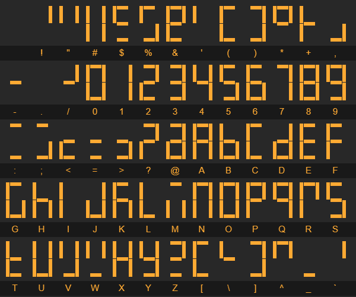
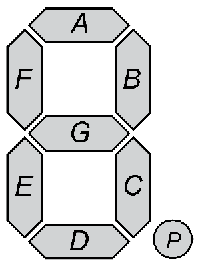

This is an automatic translation and may be incorrect in some places. See the source README and examples for authoritative information.

[](https://github.com/GyverLibs/GyverSegment/releases/latest/download/GyverSegment.zip)
[](https://registry.platformio.org/libraries/gyverlibs/GyverSegment)
[](https://alexgyver.ru/)
[](https://alexgyver.ru/support_alex/)
[](https://github-com.translate.goog/GyverLibs/GyverSegment?_x_tr_sl=ru&_x_tr_tl=en)  

[](https://t.me/GyverLibs)

# GyverSegment
The most powerful library for working with displays on 7-segment indicators
- Support for all popular Chinese modules (74HC595 4/8 digits, TM1637 4/6 digits + colon, MAX7219 cascade of any length)
- Symbolic processor and built-in font: convenient display of any data
- A single API for all displays
- Running line, you can output several on one display
- 7 Animated Character Switch Effects
- Easy API to support all the features on any other display
- Brightness settings, including for dynamic displays
- GyverIO-based fast bitbang – sending data to the display 10 times faster than other libraries

### Compatibility
Compatible with all Arduino platforms (Arduino features are used)

### Dependencies
- [GyverIO](https://github.com/GyverLibs/GyverIO)

## Contents
- [Documentation.](#docs)
  - [Displays](#disp)
  - [buffer](#buf)
  - [Running line](#run)
  - [Effects.](#eff)
  - [Utilities.](#util)
  - [Add the display](#add)
- [Examples](#examples)
- [Versions](#versions)
- [Installation](#install)
- [Bugs and feedback](#feedback)

<a id="docs"></a>
<a id="disp"></a>
## Documentation.
### Supported displays
> If you find a good display module that is not supported by the library, write. I'll order, test, add.

| Photo | Controller | Size | AliExpress | Class |
|-----------------------------------------------------------------------------------------------------------------------------------------------------------------------------------------------
| | TM1637     | 0.36"  | [reference](https://fas.st/HEYSD?erid=LatgBbQo6), [reference](https://fas.st/kIITut?erid=LatgBbQo6), [reference](https://fas.st/PQw6B?erid=LatgBbQo6)  | `Disp1637Colon` |
|  | TM1637     | 0.56"  | [reference](https://fas.st/Y9x-Ei?erid=LatgBbQo6), [reference](https://fas.st/i9Wnt?erid=LatgBbQo6)                                                 | `Disp1637Colon` |
|        | TM1637     | 0.36"  | [reference](https://fas.st/6Ntg-?erid=LatgBbQo6), [reference](https://fas.st/zfmia?erid=LatgBbQo6), [reference](https://fas.st/s60Yu?erid=LatgBbQo6)   | `Disp1637_4`    |
|        | TM1637     | 0.56"  | [reference](https://fas.st/i9Wnt?erid=LatgBbQo6), [reference](https://fas.st/VBGW8?erid=LatgBbQo6)                                                  | `Disp1637_4`    |
|        | TM1637     | 0.36"  | [reference](https://fas.st/4uHOCd?erid=LatgBbQo6), [reference](https://fas.st/upp5P?erid=LatgBbQo6), [reference](https://fas.st/tT1PEx?erid=LatgBbQo6) | `Disp1637_6`    |
|        | TM1637     | 0.56"  | [reference](https://fas.st/i0dmi?erid=LatgBbQo6)                                                                                                 | `Disp1637_6`    |
|                    | 74HC595    | 0.36"  | [reference](https://fas.st/WC-EE?erid=LatgBbQo6), [reference](https://fas.st/5d6JH?erid=LatgBbQo6), [reference](https://fas.st/UT6RqC?erid=LatgBbQo6)  | `Disp595_4`*    |
|                    | 74HC595    | 0.36"  | [reference](https://fas.st/SzV0w?erid=LatgBbQo6), [reference](https://fas.st/YM7Fu?erid=LatgBbQo6)                                                  | `Disp595_8`*    |
|                | 74HC595    | 0.36"<br/>0.56"  | [reference](https://fas.st/6x9q9R?erid=LatgBbQo6)                                                                                          | `Disp595_8v2`*  |
|               | 74HC595    | 0.56"  | [reference](https://fas.st/wlOjS?erid=LatgBbQo6), [reference](https://fas.st/9eA7PC?erid=LatgBbQo6), [reference](https://fas.st/U6eEnq?erid=LatgBbQo6) | `Disp595Static` |
|                      | MAX7219    | 0.36"  | [reference](https://fas.st/_ugxv1?erid=LatgBbQo6), [reference](https://fas.st/IqQly3?erid=LatgBbQo6)                                                | `Disp7219`      |
|                      | -          |-       |                                                                                                                                               | `DispBare`*     |

> `*`- dynamic displays

### How the library works
- All displays work in the program buffer mode - after making changes to the buffer, you need to call`update()`. Running string and switching effects themselves cause`update()`when they need it
- All displays inherit class`SegBuffer`, which is responsible for data output, so the output is the same for all displays
- Tools`SegRunner`(running line) and`SegAnimation`Switching effects also work the same for all displays.
- Some displays have additional methods

### General.
```cpp
void power(bool state);     // Power management (true on, false off)
void update();              // upgrade
uint8_t* buffer;            // buffering
```

### TM1637
```cpp
Disp1637Colon(uint8_t DIO, uint8_t CLK, bool dots);  // Module 4 digits + colon
Disp1637_4(uint8_t DIO, uint8_t CLK);     // Module 4 digits + points
Disp1637_6(uint8_t DIO, uint8_t CLK);     // Module 6 digits + points

// all
void brightness(uint8_t bright);          // brightness, 0..7

// Disp1637Colon
void colon(bool show);                    // colon-off

// Defile settings (announce before connecting the library)
#define DISP1637_CLK_DELAY 100   // interface delay
```

### 74HC595
```cpp
Disp595_4(uint8_t DIO, uint8_t SCLK, uint8_t RCLK);     // Module 4 figures
Disp595_8(uint8_t DIO, uint8_t SCLK, uint8_t RCLK);     // 8 digit module
Disp595_8v2(uint8_t DIO, uint8_t SCLK, uint8_t RCLK);   // 8 digit module, other wiring
Disp595Static<int amount> (uint8_t SDI, uint8_t SCLK, uint8_t LOAD); // any number of numbers. Static display!

// all
uint8_t tick();       // Dynamic display ticker, call in loop
uint8_t tickManual(); // dynamic display ticker, call on its timer
void brightness(uint8_t bright);    // set the brightness (0..15)

// Defile settings (announce before connecting the library)
#define DISP595_CLK_DELAY 0   // interface delay
#define GS_EXP_TIME 100       // familiarity
```

> `Disp595Static`unchallenged`tick`. But if you need to control the brightness, you need to call`tick`!

### MAX7219
```cpp
// 8 digit module
Disp7219<int amount>(uint8_t DIN, uint8_t CLK, uint8_t CS, bool reverse = true);

void begin();                       // initialize (needed after the module power reset)
void brightness(uint8_t value);     // set the brightness (0..15)

uint8_t getAmount();                // chip out
void brightness(uint8_t* value);    // set brightness (0...15) for multiple chips
void power(uint8_t* state);         // Power management (true on, false off) for multiple chips

// Defile settings (announce before connecting the library)
#define DISP7219_CLK_DELAY 0   // interface delay
```
- `amount`- number of MAX7219 chips, each chip supports 8 indicators, chips can be connected with a cascade to increase the length of the running line
- `reverse`deploys output data from right to left for Chinese modules (silent on). If you collect your display by datasheet - when you announce you need to put`false`

### Naked display
```cpp
DispBare<uint8_t digits, bool decimal = 1, bool anode = 0>(uint8_t* dig, uint8_t* seg);

uint8_t tick();       // Dynamic display ticker, call in loop
uint8_t tickManual(); // dynamic display ticker, call on its timer
void brightness(uint8_t bright);    // set the brightness (0..15)

// Defile settings (announce before connecting the library)
#define GS_EXP_TIME 100       // familiarity
```
- `digits`- number of indicators
- `decimal`- indicator with DP decimal points that are connected to the pin
- `anode` - `true`- general anode,`false`- common cathode
- `dig`- an array of indicator pins (coincides in number with`digits`)
- `seg`Array of pin segments (7 pins without a point)`decimal`, 8 with a point)

> Scheme and online simulation[here](https://wokwi.com/projects/310739760533471808)

### Interface speed
Almost all supported displays can adjust the speed of the interface through defiance`DISPxxx_CLK_DELAY`This is a delay in microseconds during data transmission, the standard values are indicated above. If the display is not working, try increasing the latency by 50-100 μs! For example, some Chinese TM1637 modules are stable at zero latency, and some require 100 μs (default). Also, when connecting the display with long wires and / or if there are sources of EM interference, you will have to increase the latency to make data transmission more reliable.

```cpp
#define DISP7219_CLK_DELAY 70
#include <GyverSegment.h>
```

### Dynamic displays
#### tick()
Dynamic displays (74HC595, DispBare) must be called ticker`tick()`, because he turns out all the numbers in turn * on his timer*. If there are delays in the program that prevent the ticker from being called, artifacts may appear on the display (uneven brightness of numbers, the disappearance of numbers and other “glitches”). If there are deaf cycles in the program, the ticker must also be called inside them:
```cpp
void loop() {
  disp.tick();

  while (1) {
    disp.tick();
    //.... break;
  }
}
```

In a simple code "on the Delays" can be used not built-in`delay()`It's a display delay. The library will call the ticker inside it:
```cpp
disp.print("hello");
disp.update();
disp.delay(1000); // ticker is called here
disp.print("1234");
disp.update();
```

How often does the library update the display?
- At maximum brightness - change the number every 1 millisecond
- At a different brightness, change the numbers each`GS_EXP_TIME`100 microseconds + waiting time corresponding to brightness

#### tickManual()
Drawing the display can be done independently by interrupting the timer or in other ways, for this there is a ticker.`tickManual()`- without a built-in timer. How often should it be called:
- At the specified maximum brightness (`15`) call the ticker every 2 milliseconds. This is enough so that the flicker is not visible (checked on an 8-bit display, on a 4-bit you can increase the time).
- If you want to control the brightness, you have to call the ticker more often - every 100 microseconds. For longer periods, a flicker at minimum brightness will appear.

<a id="buf"></a>

### SegBuffer - display output
Output on the display is carried out in the same way as 99% of other displays and libraries: you need to install a cursor in the screen.`setCursor(x)`and bring the necessary data into`print(данные)`:
- You can install the cursor, including "behind the display" to create your own animations and other scenarios.
- `print()`- standard interface[library](https://www.arduino.cc/reference/en/language/functions/communication/serial/print/), outputs any data (integers, floating point, rows of any type)
- The cursor is automatically shifted to the length of the text.
- To update the display, call`update()`
- The library has a fairly readable font with all Latin letters and symbols (32). 126 ASCII). Linear letters are equivalent to large
- Points in the text are processed separately and displayed in the decimal divider of the display, if any.
- There's a regime.`printRight(true)`, in which the data will be printed from right to left from the current cursor position. The cursor in this case does not shift during printing, instead the entire display is shifted to the left.

  

```cpp
  DispXXX disp;   // any display from the library
  // ...
  disp.setCursor(0);
  disp.print("hello");
  disp.update();

  // flattening
  // number of unknown length
  int val = 123;
  disp.setCursorEnd(sseg::intLen(val) - 1);
  disp.print(val);

  // so
  disp.printRight(true);  // print
  disp.setCursorEnd();    // pointer
  // disp.fillChar('0'); // zero-fill
  disp.print(val);
  disp.printRight(false); // switch off

  disp.writeByte(0b11001100); // output your data to segments
```

<details >>
<summary>class description</summary >>

```cpp
// designer. decimal - does the display support decimal points
SegBuffer(uint8_t* buffer, uint8_t size, bool decimal);

// set the cursor for printing, 0 (beginning) on the left
void setCursor(int16_t pos);

// launch
void home();

// set the cursor from the end of the display (right to left)
void setCursorEnd(int16_t pos = 0);

// cursor
int16_t getCursor();

// check whether the int number fits with the current cursor
bool checkInt(int32_t val);

// Check whether the float number fits with the current cursor
bool checkFloat(double val, uint8_t dec = 2);

// position
void setChar(uint8_t pos, char symb);

// position
void set(uint8_t pos, uint8_t data);

// symbolize
void fillChar(char symb);

// code
void fill(uint8_t data);

// cleanse
void clear();

// Direction of printing: false - printing on the left, true - moving on the right
void printRight(bool right);

// buffer-shift
void printRight(bool right, uint8_t shiftSize);

// set or turn off the decimal point in the position
void point(uint8_t pos, bool state = 1);

// display the clock (hour without zero, minute with zero) starting from the specified position of the cursor
void showClock(uint8_t hour, uint8_t minute, uint8_t from = 0);

// Put the symbol in the current cursor position
size_t write(uint8_t data);

// Put the byte into the current cursor position
void writeByte(uint8_t data);
void writeByte(uint8_t* data, uint8_t len);

// display size
uint8_t getSize();

// analogue delay, but inside it is called ticker dynamic indication
void delay(uint32_t prd);

// Clean, print on the left, update
void clearPrint(T v);
void clearPrint(T v, uint8_t d);

// clean, print on the right, update
void clearPrintR(T v);
void clearPrintR(T v, uint8_t d);
```
</details>

<a id="run"></a>

### SegRunner - running line
Asynchronous output to the running line display within the established cursor boundaries
- Since the output is asynchronous, the string must be either declared globally or in the ticker definition area for the duration of the running string.
- During movement, the line can be changed, it will work correctly. But if the line length changes, you need to call`setText()`to count it. The movement won't start again!
- After leaving the left edge of the display, the motion line automatically starts first. You can track it by the result.`tick()`(see below)

```cpp
DispXXX disp;           // any display from the library
SegRunner run(&disp);   // transmit

const char cstr_p[] PROGMEM = "progmem cstring";
const char* cstr[] = "cstring pointer";
char cstr_a[] = "global char array";
String str = "global String";

void setup() {
  // so-so
  run.setText_P(cstr_p);
  run.setText(cstr);
  run.setText(cstr_a);
  run.setText(str);
  // String literals are originally global.
  run.setText("hello");

  // You can't.
  String lstr = "local String";
  run.setText(lstr);
  char lcstr_a[] = "local char array";
  run.setText(lcstr_a);

  run.start();  // launch
  // run.setWindow(1, 6); The boundaries within which the text moves
}

void loop() {
  // The movement takes place here on a timer.
  run.tick();
}
```

You can work locally like this:
```cpp
void foo() {
  SegRunner run(&disp);
  String str = "local string";
  run.setText(s);
  run.start();
  run.waitEnd();
  // This also works for dynamic displays.
}
```

<details >>
<summary>class description</summary >>

```cpp
// designer
SegRunner(SegBuffer* buf);

// set the text const char*
void setText(const char* str);

// string
void setText(String& str);

// Install text from PROGMEM (Global)
void setText_P(PGM_P str);

// set the output window (x0, x1)
void setWindow(uint8_t x0, uint8_t x1);

// set the speed (symbols per second)
void setSpeed(uint16_t symPerSec);

// set the speed (period in ms)
void setPeriod(uint16_t ms);

// run out
void start();

// stop
void stop();

// continue
void resume();

// True - the line moves
bool running();

// wait
void waitEnd();

// ticker. Return 0 idle, 1 in a new step, 2 at the end of the movement
// You can transfer false so that the display does not update itself.
uint8_t tick(bool update = true);

// Move a line by 1 character. You can transfer false so that the display does not update itself.
uint8_t tickManual(bool update = true);

// Tick return statuses:
GS_RUNNER_IDLE
GS_RUNNER_STEP
GS_RUNNER_END
```
</details>

<a id="eff"></a>

### SegAnimation - Switching Effects
Asynchronous animations of data change on the display
- Animation creates its own buffer type`SegBuffer`In which you need to display new data *instead of displaying *
- The system itself will see the change in data and reproduce the established effect to change the image to the current one.
- The animation is played only within the specified boundaries of the display (beginning, length), the rest of the display does not affect

Effects:
```cpp
SegEffect::Blink
SegEffect::RollUp
SegEffect::RollDown
SegEffect::TwistFill
SegEffect::TwistClear
SegEffect::SlideUp
SegEffect::SlideDown
```

```cpp
DispXXX disp;           // any display from the library
// specify the number of symbols, display and position of the display cursor
SegAnimation<3> anim(&disp, 0);

void setup() {
  anim.setEffect(SegEffect::TwistClear);
  anim.start();

  // Find new data and wait for the effect to end
  // Expectation works correctly, including for dynamic displays
  anim.setCursor(0);
  anim.print(random(1000));
  anim.waitEnd();
  disp.delay(1000);

  anim.setCursor(0);
  anim.print(random(1000));
  anim.waitEnd();
  disp.delay(1000);
}

void loop() {
  anim.tick();
  disp.tick();

  static uint32_t tmr;
  if (millis() - tmr >= 1000) {
    // If you change the animator data,
    // He'll update the display himself.
    anim.setCursor(0);
    anim.print(random(1000));
  }
}
```

<details >>
<summary>class description</summary >>

```cpp
// designer
SegAnimation(SegBuffer* disp, uint8_t from, bool dec = 1);

// Determine the effect and time of its implementation in MS
void setEffect(SegEffect eff, uint16_t duration = 300);

// launch
void start();

// stop animation
void stop();

// True - the effect is reproduced
bool running();

// forcefully update the display from the effect buffer
void refresh();

// Reproduce the effect on all numbers (silent response)
void forceAll(bool force);

// wait
void waitEnd();

// ticker. Return 0 idle, 1 in a new step, 2 at the end of the animation
uint8_t tick();

// hand ticker. Return 0 idle, 1 in a new step, 2 at the end of the animation
uint8_t tickManual();

// Tick return statuses:
GS_ANIMATION_IDLE
GS_ANIMATION_STEP
GS_ANIMATION_END
```
</details>

<a id="util"></a>

### Utilities.

```cpp
// code
uint8_t sseg::getCharCode(char symb);

// length
uint8_t sseg::intLen(int32_t val);
uint8_t sseg::intLen(uint32_t val);

// get the length of the float number at the specified accuracy
uint8_t sseg::floatLen(double val, uint8_t dec = 2);
```

<a id="add"></a>

### How to add a display
The library makes it very easy to add its capabilities (output, running line, effects) to any other 7-segment displays, even homemade ones. It is enough to create a class from`SegBuffer`and implement it:
- Buffer for the right amount of familiarity
- Method`update()`which will display this buffer on the display
- Method`tick()`(for dynamic displays)
- The buffer has the following bit order:`0bPGFEDCBA`



```cpp
// Number of acquaintances and presence of points
// constant names are given as an example
#define MY_DISP_SIZE 4
#define MY_DISP_DECIMALS true

class MyDisp : public SegBuffer {
   public:
    MyDisp() : SegBuffer(buffer, MY_DISP_SIZE, MY_DISP_DECIMALS) {}

    // upgrade
    void update() {
        // code
        return 0;
    }

    // dynamic indication ticker, call to loop continuously or by timer
    uint8_t tick() {
        // code
        return 0;
    }

    uint8_t buffer[MY_DISP_SIZE] = {0};

   private:
};
```

Now your display supports all the features of the library!

<a id="examples"></a>

## Examples
### Demka
```cpp
#include <Arduino.h>
#include <GyverSegment.h>

#define DIO_PIN 2
#define CLK_PIN 3
#define LAT_PIN 4

// display announcement. Choose any one.
Disp595_4 disp(DIO_PIN, CLK_PIN, LAT_PIN);
// Disp595_8 disp(DIO_PIN, CLK_PIN, LAT_PIN);
// Disp595_8v2 disp(DIO_PIN, CLK_PIN, LAT_PIN);
// Disp595Static<4> disp(DIO_PIN, CLK_PIN, LAT_PIN);
// Disp1637_4 disp(DIO_PIN, CLK_PIN);
// Disp1637_6 disp(DIO_PIN, CLK_PIN);
// Disp1637Colon disp(DIO_PIN, CLK_PIN);
// Disp7219<1> disp(DIO PIN, CLK PIN, LAT PIN), // 1 chip - 8 digits

uint8_t digs[] = {2, 3, 4, 5, A2, A3, A4, A5};  // number-pin
uint8_t segs[] = {6, 7, 8, 9, 10, 11, 12, 13};  // segment-pin
// 8 digits, ten dots are, common cathode
// DispBare<8, true, false> disp(digs, segs);

void setup() {
  // Disp.delay() is used for single display displays.

  // text
  disp.setCursor(0);
  disp.print("hello");
  disp.update();
  disp.delay(1000);

  // whole
  disp.setCursor(0);
  disp.print(1234);
  disp.update();
  disp.delay(1000);

  // float
  disp.setCursor(0);
  disp.print(3.14, 3);  // precision
  disp.update();
  disp.delay(1000);

  // numeral
  disp.setCursorEnd();
  disp.printRight(true);
  disp.fillChar('0');
  disp.print(3.14, 3);
  disp.update();
  disp.delay(1000);

  disp.printRight(false);
}
void loop() {
  // It is necessary for displays with dynamic display, but
  // All displays are compatible, even if they do nothing.
  disp.tick();
}
```

### Right-aligned counter
```cpp
#include <GyverSegment.h>

Disp1637_4 disp(2, 3);

void setup() {
  disp.printRight(true);  // print
  disp.setCursorEnd();    // pointer
}

int n = 0;

void loop() {
  disp.clear();
  disp.print(n);
  disp.update();
  n++;
  disp.delay(100);  // din-display
}
```

<a id="versions"></a>
## Versions
- v1.0
- v1.1 - ForceAll() and length for printRight() added
- v1.1.1 - bug corrected
- v1.1.2 - fix the printRight bug
- v1.2 
  - Rewritten brightness driver for dynamic displays. Reduced load on the processor, increased stability
  - Added manual ticker for dynamic displays
- v1.3 - Disp595 display support added  8v2
- v1.4 - Disp595Static display support added
- v1.4.2 - packet brightness control 7219 and raw data output mode writeByte added

<a id="install"></a>
## Installation
- The library can be found under the name **GyverSegment** and installed through the library manager in:
    - Arduino IDE
    - Arduino IDE v2
    - PlatformIO
- [Download the library](https://github.com/GyverLibs/GyverSegment/archive/refs/heads/main.zip).zip archive for manual installation:
    - Unpack and put in *C:\Program Files (x86)\Arduino\libraries* (Windows x64)
    - Unpack and put in *C:\Program Files\Arduino\libraries* (Windows x32)
    - Unpack and put in *Documents/Arduino/libraries/ *
    - (Arduino IDE) Automatic installation from .zip: *Sketch/Connect library/Add .ZIP library...* and specify downloaded archive
- Read more detailed instructions for installing libraries[here](https://alexgyver.ru/arduino-first/#%D0%A3%D1%81%D1%82%D0%B0%D0%BD%D0%BE%D0%B2%D0%BA%D0%B0_%D0%B1%D0%B8%D0%B1%D0%BB%D0%B8%D0%BE%D1%82%D0%B5%D0%BA)
### Update
- I recommend always updating the library: new versions fix errors and bugs, as well as optimize and add new features.
- Through the library manager IDE: find the library as when installing and click "Update"
- Manually: **Delete the folder with the old version** and then put the new one in its place. “Replacement” can not be done: sometimes new versions delete files that will remain when replaced and can lead to errors!

<a id="feedback"></a>
## Bugs and feedback
If you find bugs, create **Issue**, or better write to the mail immediately.[alex@alexgyver.ru](mailto:alex@alexgyver.ru)  
The library is open for revision and your **Pull Requests*!

When reporting bugs or incorrect work of the library, it is necessary to specify:
- Library version
- What is used by the IC
- SDK version (for ESP)
- Arduino IDE version
- Are embedded examples that use features and designs that cause bugs in your code working correctly?
- What code was downloaded, what work was expected from it and how it works in reality
- Ideally, attach the minimum code in which the bug is observed. Not a canvas of a thousand lines, but a minimum code.
